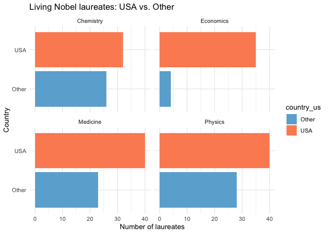
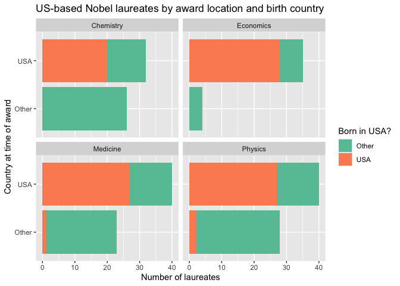

Lab 03 - Nobel laureates
================
Insert your name here
Insert date here

### Load packages and data

``` r
library(tidyverse) 
```

``` r
nobel <- read_csv("data/nobel.csv")
```

## Exercises 1

The dataset contains 935 observations and 26 variables. Each row
represents a single Nobel Prize award received in a given year and
category.

``` r
nobel_living <- nobel %>%
  filter(
    is.na(died_date),
    !is.na(country),
    gender != "org")
```

After applying these filters, the resulting dataset contains 228
observations.

### Exercise 2

``` r
nobel_living <- nobel_living %>%
  mutate(
    country_us = if_else(country == "USA", "USA", "Other")
  )
```

``` r
nobel_living_science <- nobel_living %>%
  filter(category %in% c("Physics", "Medicine", "Chemistry", "Economics"))
```

``` r
nobel_living_science %>%
  ggplot(aes(x = country_us, fill = country_us)) +
  geom_bar() +
  facet_wrap(~ category) +
  coord_flip() +
  labs(
    x = "Country",
    y = "Number of laureates",
    title = "Living Nobel laureates: USA vs. Other"
  ) + 
     scale_fill_manual(values = c("Other" = "#6baed6", "USA" = "#fc8d62")) + 
  theme_minimal()
```

<!-- -->

Make it more colorful

### Exercise 3

``` r
nobel_living_science <- nobel_living_science %>%
  mutate(
    born_country_us = if_else(born_country == "USA", "USA", "Other"))
```

``` r
n_born_usa <- nobel_living_science %>%
  filter(born_country_us == "USA") %>%
  nrow()
```

there are 105 winners who are born in the USA

``` r
nobel_living_science %>%
  ggplot(aes(x = country_us, fill = born_country_us)) +
  geom_bar() +
  facet_wrap(~ category) +
  coord_flip() +
  labs(
    x = "Country at time of award",
    y = "Number of laureates",
    fill = "Born in USA?",
    title = "US-based Nobel laureates by award location and birth country"
  ) +
  scale_fill_manual(
    values = c("Other" = "#66c2a5", "USA" = "#fc8d62")
  )
```

<!-- -->

So,Most Nobel laureates were based in the United States at the time they
received their awards, which is broadly consistent with Buzzfeed’s
initial claim. However, looking more closely at the color segments
within the bars, a substantial proportion of those who won their prizes
while working in the U.S. were not born there. \### Exercise 4

``` r
birth_country_counts <- nobel_living_science %>%
  filter(
    country_us == "USA",
    born_country_us == "Other"
  ) %>%
  count(born_country, sort = TRUE)

birth_country_counts
```

    ## # A tibble: 21 × 2
    ##    born_country       n
    ##    <chr>          <int>
    ##  1 Germany            7
    ##  2 United Kingdom     7
    ##  3 China              5
    ##  4 Canada             4
    ##  5 Japan              3
    ##  6 Australia          2
    ##  7 Israel             2
    ##  8 Norway             2
    ##  9 Austria            1
    ## 10 Finland            1
    ## # ℹ 11 more rows

The most common country of birth among Nobel laureates who won their
prizes while based in the United States but were born elsewhere is
Germany, with 7 laureates. This country is tied with United Kingdom,
which also has 7 laureates.

BTW, This solution was written after examining the output(there are 2
country being tied with). A more general solution would involve
iterating through the counts from the top until no ties remain,and then
get the **n**, determining how many countries share the highest
frequency, and then generating the linein sentence accordingly.
